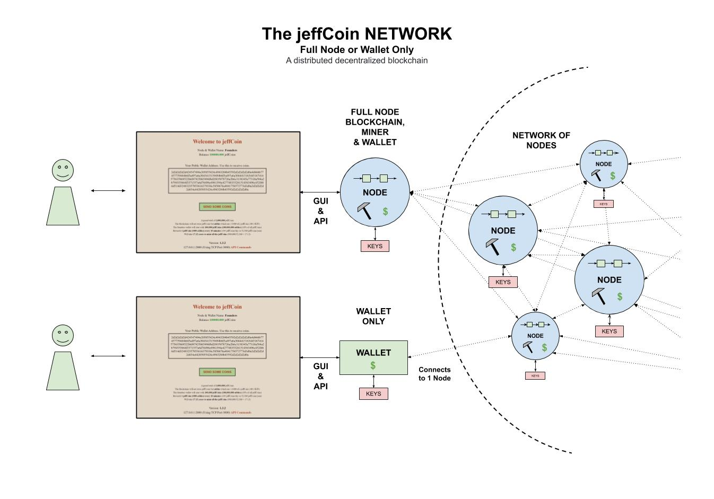
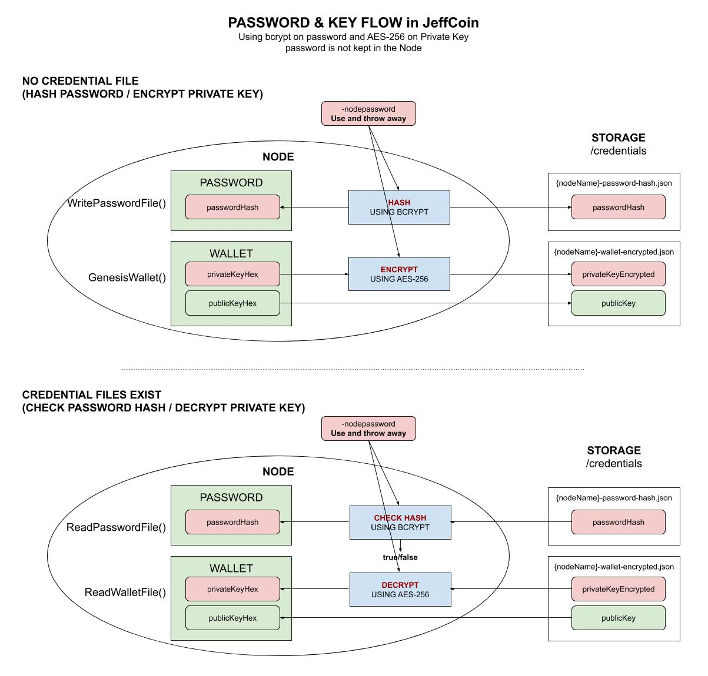

# jeffCoin

```text
*** THE REPO IS UNDER CONSTRUCTION - CHECK BACK SOON ***
```

[](https://github.com/JeffDeCola/jeffCoin/tags)
[](https://pkg.go.dev/github.com/JeffDeCola/jeffCoin)
[](https://goreportcard.com/report/github.com/JeffDeCola/jeffCoin)
[](https://codeclimate.com/github/JeffDeCola/jeffCoin/maintainability)
[](https://codeclimate.com/github/JeffDeCola/jeffCoin/issues)
[](http://jeffdecola.mit-license.org)
[](https://jeffdecola.com)

_A cryptocurrency (transaction based data) built on distributed decentralized
multi-node P2P open Network using a sha256 Proof of Work (PoW) **blockchain**
with a REST JSON API and a TCP Server to communicate between
the Nodes over IP._

Or more simply, **a distributed decentralized public ledger.**

To dive right in, head down to [RUN](https://github.com/JeffDeCola/jeffCoin#run).

Table of Contents

* [PREREQUISITES](https://github.com/JeffDeCola/jeffCoin#prerequisites)
* [BUILDING BLOCKS](https://github.com/JeffDeCola/jeffCoin#building-blocks)
* [OVERVIEW](https://github.com/JeffDeCola/jeffCoin#overview)
* [SOFTWARE ARCHITECTURE](https://github.com/JeffDeCola/jeffCoin#software-architecture)
* [YOUR PASSWORD & KEYS](https://github.com/JeffDeCola/jeffCoin#your-password--keys)
* [RUN](https://github.com/JeffDeCola/jeffCoin#run)
  * [GENESIS NODE](https://github.com/JeffDeCola/jeffCoin#genesis-node)
  * [ADDING NEW NODES](https://github.com/JeffDeCola/jeffCoin#adding-new-nodes)
  * [LOGGING](https://github.com/JeffDeCola/jeffCoin#logging)
  * [WEBSERVER & REST API](https://github.com/JeffDeCola/jeffCoin#webserver--rest-api)
  * [PLAY AROUND](https://github.com/JeffDeCola/jeffCoin#play-around)
  * [SWITCHES (REFERENCE)](https://github.com/JeffDeCola/jeffCoin#switches-reference)
* [RUN (WALLET ONLY)](https://github.com/JeffDeCola/jeffCoin#run-wallet-only)
* [RUN (OPTIONAL)](https://github.com/JeffDeCola/jeffCoin#run-optional)
  * [CONNECT USING TCP](https://github.com/JeffDeCola/jeffCoin#connect-using-tcp)
  * [TEST MOCK TRANSACTIONS](https://github.com/JeffDeCola/jeffCoin#test-mock-transactions)
  * [RUN ON GOOGLE COMPUTE ENGINE (GCE)](https://github.com/JeffDeCola/jeffCoin#run-on-google-compute-engine-gce)

Documentation and Reference

* [blockchain-cheat-sheet](https://github.com/JeffDeCola/my-cheat-sheets/tree/master/software/development/software-architectures/blockchain/blockchain-cheat-sheet)
* I got a lot of inspiration
  [here](https://github.com/nosequeldeebee/blockchain-tutorial)
* My software architecture is located in
  [architecture.md](https://github.com/JeffDeCola/jeffCoin/blob/master/architecture.md)
* This repos
  [github webpage](https://jeffdecola.github.io/jeffCoin/)
  _built with
  [concourse](https://github.com/JeffDeCola/jeffCoin/blob/master/ci-README.md)_

## PREREQUISITES

```bash
go get -v -u github.com/btcsuite/btcutil/base58
go get -v -u golang.org/x/crypto/ripemd160
go get -u -v github.com/gorilla/mux
go get -u -v github.com/sirupsen/logrus
go get -u -v github.com/pkg/errors
go get -u -v github.com/satori/go.uuid
go get -u -v golang.org/x/crypto/bcrypt
```

## SOFTWARE STACK

* **GUI**
  _golang net/http package_
* **Routing & REST API framework**
  _golang gorilla/mux package_
* **Inter Node Communication**
  _golang TCP package_
* **Backend**
  _golang_
* **Database**
  _N/A_

## BUILDING BLOCKS

This project was built from some of my other projects,

* **BLOCKCHAIN**
  * The blockchain built from my
    [single-node-blockchain-with-REST](https://github.com/JeffDeCola/my-go-examples/tree/master/blockchain/single-node-blockchain-with-REST)
  * **BLOCKCHAIN TRANSACTIONS** are built from my
    [bitcoin-ledger](https://github.com/JeffDeCola/my-go-examples/tree/master/blockchain/bitcoin-ledger)
  * The ECDSA signature verification built from my
    [ecdsa-digital-signature](https://github.com/JeffDeCola/my-go-examples/tree/master/cryptography/asymmetric-cryptography/ecdsa-digital-signature)
* **ROUTINGNODE**
  * The TCP Server built from my
    [simple-tcp-ip-server](https://github.com/JeffDeCola/my-go-examples/tree/master/api/simple-tcp-ip-server)
* **WALLET**
  * Generating keys and creating the jeffCoin address
    is built from my
    [create-bitcoin-address-from-ecdsa-publickey](https://github.com/JeffDeCola/my-go-examples/tree/master/blockchain/create-bitcoin-address-from-ecdsa-publickey)
  * The Wallet Private Key is encrypted using
    [aes-256-gcm](https://github.com/JeffDeCola/my-go-examples/tree/master/cryptography/symmetric-cryptography/aes-256-gcm)
* **WEBSERVER**
  * The GUI & REST JSON API is built from my
    [simple-webserver-with-REST](https://github.com/JeffDeCola/my-go-examples/tree/master/api/simple-webserver-with-REST)
  * The password is hashed and checked using
    [bcrypt-password-hashing](https://github.com/JeffDeCola/my-go-examples/tree/master/cryptography/hashing/bcrypt-password-hashing)
* **OTHER**
  * I also use my
    [errors](https://github.com/JeffDeCola/my-go-examples/tree/master/packages/errors),
    [logrus](https://github.com/JeffDeCola/my-go-examples/tree/master/packages/logrus),
    and
    [flag](https://github.com/JeffDeCola/my-go-examples/tree/master/packages/flag)
    projects

## OVERVIEW

`jeffCoin` (JEFF) is my interpretation of a transaction based (ledger) using a blockchain.
This is a work in progress I feel can be used as a foundation for
building bigger and better things.

The following illustration shows the jeffCoin Network of Nodes,



Coins (a.k.a jeffCoins) are minted as follows,

* A grand total of **1,000,000 jeffCoins**
* The blockchain will not store jeffCoins but **addies** which are
  1/1000 of a jeffCoin (.001 JEFF)
* The founders wallet will start with **100,000 jeffCoins (100,000,000 addies)**
  (10% of all jeffCoins)
* Rewards **1 jeffCoin (1000 addies) every 10 minutes**
  _(144 jeffCoins/day or 52,560 jeffCoins/year)_
* Will take **17.12 years to mint all the jeffCoins**
  _(900,000/52,560 = 17.12)_

jeffCoin uses the following technology,

* Written in golang
* Implements a blockchain using a sha256 hash
* A distributed decentralized multi-node P2P architecture maintaining
  a Network of Nodes
* A Webserver with both a GUI and a REST API
* A TCP Server for inter-node communication
* ECDSA Private & Public Key generation
* Private Key AES-256 encryption for storage
* Creates a jeffCoin Address from the ECDSA Public Key
  _(Just like bitcoin)_ currently not being used
* ECDSA Digital Signature Verification
* Mining uses Proof of Work (PoW)
* Transaction as stored using an unspent transaction output model
* Password hashing and storage using bcrypt

What jeffCoin does not have,

* No database, so if the entire Network dies, the chain dies
* Rigorous testing of all corner cases

## SOFTWARE ARCHITECTURE

This readme got too big so I moved my software explanation to
[architecture.md](https://github.com/JeffDeCola/jeffCoin/blob/master/architecture.md).

I divided the software into 5 sections,

* [1. BLOCKCHAIN](https://github.com/JeffDeCola/jeffCoin/blob/master/architecture.md#1-blockchain)
  * [1.1 BLOCKCHAIN](https://github.com/JeffDeCola/jeffCoin/blob/master/architecture.md#11-blockchain)
  * [1.2 TRANSACTIONS](https://github.com/JeffDeCola/jeffCoin/blob/master/architecture.md#12-transactions)
* [2. MINER](https://github.com/JeffDeCola/jeffCoin/blob/master/architecture.md#2-miner)
* [3. ROUTINGNODE](https://github.com/JeffDeCola/jeffCoin/blob/master/architecture.md#3-routingnode)
  * [3.1 NODELIST](https://github.com/JeffDeCola/jeffCoin/blob/master/architecture.md#31-nodelist)
  * [3.2 TCP REQUESTS & HANDLERS](https://github.com/JeffDeCola/jeffCoin/blob/master/architecture.md#32-tcp-requests--handlers)
* [4. WALLET](https://github.com/JeffDeCola/jeffCoin/blob/master/architecture.md#4-wallet)
* [5. WEBSERVER](https://github.com/JeffDeCola/jeffCoin/blob/master/architecture.md#5-webserver)
  * [5.1 GUI](https://github.com/JeffDeCola/jeffCoin/blob/master/architecture.md#51-gui)
  * [5.2 REST API](https://github.com/JeffDeCola/jeffCoin/blob/master/architecture.md#52-rest-api)

## YOUR PASSWORD & KEYS

Your secrets are kept in `/credentials` in .json files.
These file are `.gitignored`.
But if they did make there way onto git you are still protected as follows,

* **Password File**
  * Stores your password hash
  * Password hashing using bcrypt
* **Wallet File**
  * Stores your Private and Public ECDSA Key
  * The Private Key is Encrypted using AES-256 with your password as your key

This illustration may help,



## RUN

If this is you first time running and you want to create your own private
Network, you need to create your first Node (Genesis Node).
You only do this once. You can also set the log level (info, debug, trace)
to cut down on the amount of logging.

### GENESIS NODE

```bash
go run jeffCoin.go \
       -genesis \
       -loglevel debug \
       -nodehttpport 2000 \
       -nodeip 127.0.0.1 \
       -nodename Founders \
       -nodetcpport 3000 \
       -nodepassword fpw
```

This will created the first Node (the Founders Node) in the Network.
It will also create a wallet and password file and save the credentials
in `/wallet` and `/password` respectively.  Not to worry, the password
is password hashed with bcrypt and your Wallet Private Key is encrypted
using AES-256. I also `.gitignore` them.

Note that the node has an IP address and port for both HTTP and TCP.
For this example I use the localhost or 127.0.0.1. But obviously,
you can pick anything you want for your rig.

**But having one node is boring so lets create more.**

### ADDING NEW NODES

To hook up to the Network you need the IP of any
working Network Node. If you have the above running Node
on `127.0.0.1:3000`, adding a second Node
"Jeff" in your network could look like,

```bash
go run jeffCoin.go \
       -loglevel debug \
       -networkip 127.0.0.1 \
       -networktcpport 3000 \
       -nodehttpport 2001 \
       -nodeip 127.0.0.1 \
       -nodename Jeff \
       -nodetcpport 3001 \
       -nodepassword jpw
```

Why stop, might as well add a third Node,

```bash
go run jeffCoin.go \
       -loglevel debug \
       -networkip 127.0.0.1 \
       -networktcpport 3000 \
       -nodehttpport 2002 \
       -nodeip 127.0.0.1 \
       -nodename Matt \
       -nodetcpport 3002 \
       -nodepassword mpw
```

### LOGGING

You will notice logging is set to `-debug`. You can be more explicit
and set to `-trace` or less wordy and set to `-info`.

### WEBSERVER & REST API

The GUI for the three nodes you just created are,

[127.0.0.1:2000](http://127.0.0.1:2000/)
**/**
[127.0.0.1:2001](http://127.0.0.1:2001/)
**/**
[127.0.0.1:2002](http://127.0.0.1:2002/)

The API page will list the various API commands.
For example, to show a particular block,

[127.0.0.1:2000/showblock/0](http://127.0.0.1:2000/showblock/0)

### PLAY AROUND

Each Node has it's own wallet, so now you can send jeffCoins/Value.
To do this, use the Webserver and API.
You will notice only the Founders have jeffCoins to send.
So Jeff or Matt will not be able to send coins until the
Founder gives them some.

Send some coins from the Founders to Jeff or Matt and note they are pending.
That's because they are not validated.  Like bitcoin, you will need
to wait 10 minutes for a miner to solve the nonce and then for
the Network to validate the transactions and reach consensus.

### SWITCHES (REFERENCE)

**`-h`** prints the following,

* **`-gce`**
  Is this Node on Google Compute Engine _(See below)_
* **`-genesis`**
  Create your first Node
* **`-loglevel`** _string_
  LogLevel (info, debug or trace) (default "info")
* **`-networkip`** _string_
  Network IP (default "127.0.0.1")
* **`-networktcpport`** _string_
  Network TCP Port (default "3000")
* **`-nodehttpport`** _string_
  Node Web Port (default "2001")
* **`-nodeip`** string
  Node IP (default "127.0.0.1")
* **`-nodename`** _string_
  Node Name (default "Jeff")
* **`-nodepassword`** _string_
  Set/Reset your Password
* **`-nodetcpport`** _string_
  Node TCP Port (default "3001")
* **`-testblockchain`**
  Loads the blockchain with test data _(See below)_
* **`-v`**
  prints current version
* **-`wallet`**
  Only the wallet and webserver GUI/API _(See below)_

## RUN (WALLET ONLY)

If you just want to have a wallet, use the `-wallet` switch.
You will not be part of the Network since there is no blockchain
or miner.  But you can always restart and become part of the Node.

You will need to hook up to a Node, so the following could work,

```bash
go run jeffCoin.go \
       -loglevel debug \
       -networkip 127.0.0.1 \
       -networktcpport 3000 \
       -nodehttpport 2005 \
       -nodeip 127.0.0.1 \
       -nodename Jills-Wallet \
       -nodetcpport 3005 \
       -nodepassword jpw \
       -wallet
```

The Node and Wallet name are the same.

## RUN (OPTIONAL)

Here are some optional things you can do.

### CONNECT USING TCP

You can also bypass the Webserver REST API and just open
a connection to the TCP server itself,

```txt
netcat -q -1 127.0.0.1 3000
```

And request commands such as,

```txt
--- Waiting for command: SBC, BANN, SNL, BVB, BC, BTR, SAB, TR, EOF
SNL
[...nodeList...]
thank you
```

Note you will need to handshake it with a `thank you` at the end.

There is a complete list of commands in the architecture readme
[TCP REQUESTS & HANDLERS](https://github.com/JeffDeCola/jeffCoin/blob/master/architecture.md#32-tcp-requests--handlers).

### TEST MOCK TRANSACTIONS

If you add the `-test` switch you will run some mock transactions from mock wallets.
Those wallets are located in `/wallets` and just used for testing.

You must use the **MockFounders** nodename,

```bash
go run jeffCoin.go \
       -genesis \
       -loglevel debug \
       -nodehttpport 2000 \
       -nodeip 127.0.0.1 \
       -nodename MockFounders \
       -nodetcpport 3000 \
       -nodepassword mfpw \
       -testblockchain
```

These transactions are the same I used in my
[bitcoin-ledger](https://github.com/JeffDeCola/my-go-examples/tree/master/blockchain/bitcoin-ledger)
example.

So your blockchain and pendingBlock should look similar to
[blockchain-output.txt](https://github.com/JeffDeCola/my-go-examples/blob/master/blockchain/bitcoin-ledger/blockchain-output.txt).

And the balances in the blockchain should be,

```txt
The balance for MockFounders PubKey (Address) is 99657000
The balance for MockJeffs PubKey (Address) is 42500
The balance for MockMatts PubKey (Address) is 265000
The balance for MockJills PubKey (Address) is 35000
The balance for MockCoinVaults PubKey (Address) is 500
```

Remember, the pendingBlock is pending, so it's not part of this calculation.
Transaction do not have value until they are part of the blockchain.

### RUN ON GOOGLE COMPUTE ENGINE (GCE)

Make sure your create a firewall rule and have your instance use
it as a network tag,

```bash
gcloud compute firewall-rules create jeffs-firewall-settings-rule \
    --action allow \
    --rules tcp:1234,tcp:3334 \
    --priority 1000 \
    --source-ranges 0.0.0.0/0 \
    --target-tags "jeffs-firewall-settings" \
    --description "Jeffs firewall rules"
```

The IP `0.0.0.0` gets forwarded to your external IP, hence I added a
`-gce switch` to deal with this,

```bash
go run jeffCoin.go \
       -gce \
       -genesis \
       -loglevel debug \
       -nodehttpport 1234 \
       -nodeip 35.203.189.193 \
       -nodename Founders \
       -nodetcpport 3334 \
       -nodepassword fpw
```

Add another node (not at gce) is as simple as connecting to it,

```bash
go run jeffCoin.go \
       -loglevel debug \
       -networkip 35.203.189.193 \
       -networktcpport 3334 \
       -nodehttpport 2003 \
       -nodeip 127.0.0.1 \
       -nodename Jill \
       -nodetcpport 3003 \
       -nodepassword jpw
```

I have a gce build example
[here](https://github.com/JeffDeCola/my-packer-image-builds#jeffs-gce-ubuntu-1904-xxxx).
