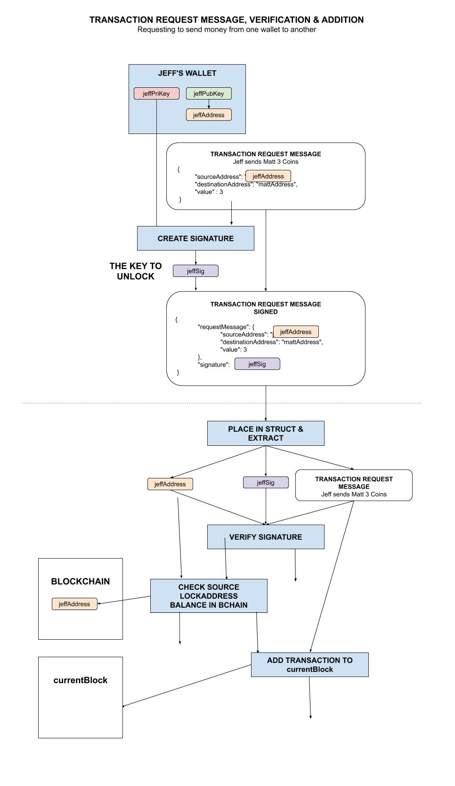
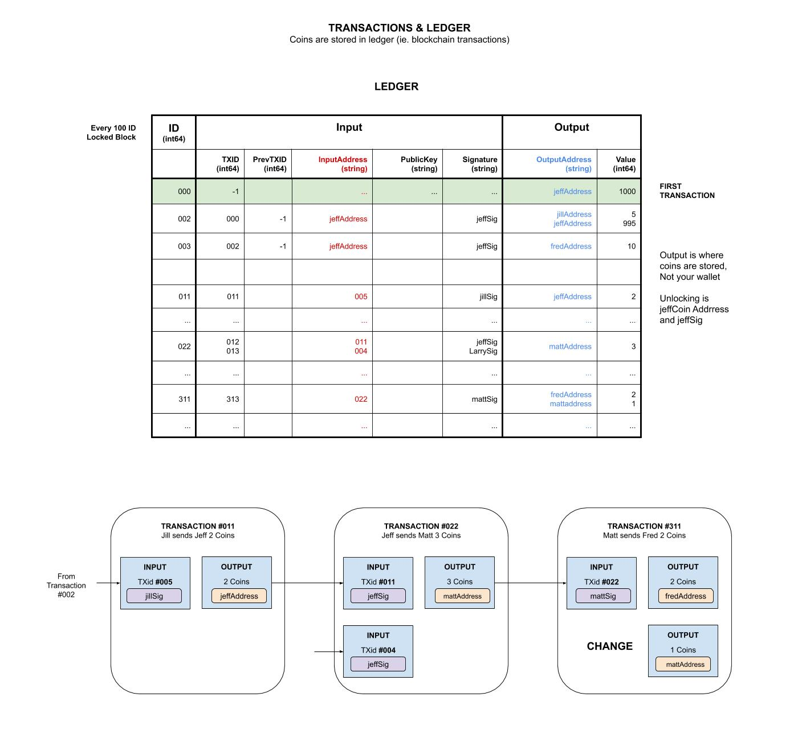

# jeffCoin

```text
*** THE REPO IS UNDER CONSTRUCTION - CHECK BACK SOON ***
```

[](https://goreportcard.com/report/github.com/JeffDeCola/jeffCoin)
[](https://godoc.org/github.com/JeffDeCola/jeffCoin)
[](https://codeclimate.com/github/JeffDeCola/jeffCoin/maintainability)
[](https://codeclimate.com/github/JeffDeCola/jeffCoin/issues)
[](http://jeffdecola.mit-license.org)

_A cryptocurrency (transaction based data) built on decentralized
multi node P2P open network using a sha256 Proof of Work blockchain
with a REST JSON API and a TCP Server to communicate between
the nodes over IP._

**Or more simply, a distributed decentralized public ledger.**

Table of Contents,

* [OVERVIEW](https://github.com/JeffDeCola/jeffCoin#overview)
* [1. BLOCKCHAIN](https://github.com/JeffDeCola/jeffCoin#1-blockchain)
  * [1.1 BLOCKCHAIN](https://github.com/JeffDeCola/jeffCoin#11-blockchain)
  * [1.2 TRANSACTIONS](https://github.com/JeffDeCola/jeffCoin#12-transactions)
* [2. MINER](https://github.com/JeffDeCola/jeffCoin#2-miner)
* [3. ROUTING NODE](https://github.com/JeffDeCola/jeffCoin#3-routing-node)
  * [3.1 NODELIST](https://github.com/JeffDeCola/jeffCoin#31-nodelist)
  * [3.2 REQUESTS AND HANDLERS](https://github.com/JeffDeCola/jeffCoin#32-requests-and-handlers)
* [4. WALLET](https://github.com/JeffDeCola/jeffCoin#4-wallet)
* [5. WEBSERVER](https://github.com/JeffDeCola/jeffCoin#5-webserver)
  * [5.1 GUI](https://github.com/JeffDeCola/jeffCoin#51-gui)
  * [5.2 REST API](https://github.com/JeffDeCola/jeffCoin#52-rest-api)
* [RUN](https://github.com/JeffDeCola/jeffCoin#run)
  * [GENESIS NODE](https://github.com/JeffDeCola/jeffCoin#genesis-node)
  * [NEW NODES](https://github.com/JeffDeCola/jeffCoin#new-nodes)
  * [WEBSERVER AND API](https://github.com/JeffDeCola/jeffCoin#webserver-and-api)
  * [ROUTING NODE](https://github.com/JeffDeCola/jeffCoin#routing-node)
* [UPDATE GITHUB WEBPAGE USING CONCOURSE (OPTIONAL)](https://github.com/JeffDeCola/jeffCoin#update-github-webpage-using-concourse-optional)

This project was built from a foundation of some of my other projects,

* The blockchain is built from my
  [single-node-blockchain-with-REST](https://github.com/JeffDeCola/my-go-examples/tree/master/blockchain/single-node-blockchain-with-REST)
* The Webserver (GUI & REST JSON API) is built from my
  [simple-webserver-with-REST](https://github.com/JeffDeCola/my-go-examples/tree/master/api/simple-webserver-with-REST)
* The Routing Node (TCP Server) is built from my
  [simple-tcp-ip-server](https://github.com/JeffDeCola/my-go-examples/tree/master/api/simple-tcp-ip-server)
* Generating Keys and creating the jeffCoin address was built from
  [create-bitcoin-address-from-ecdsa-publickey](https://github.com/JeffDeCola/my-go-examples/tree/master/blockchain/create-bitcoin-address-from-ecdsa-publickey)
* ECDSA digital signature verification was built from
  [ecdsa-digital-signature](https://github.com/JeffDeCola/my-go-examples/tree/master/cryptography/asymmetric-cryptography/ecdsa-digital-signature)

Documentation and reference,

* Refer to my
  [cheat sheet on blockchains](https://github.com/JeffDeCola/my-cheat-sheets/tree/master/software/development/software-architectures/blockchain/blockchain-cheat-sheet)
* I got a lot of inspiration from
  [here](https://github.com/nosequeldeebee/blockchain-tutorial)

[GitHub Webpage](https://jeffdecola.github.io/my-go-examples/)

## OVERVIEW

`jeffCoin` is my interpretation of a transaction based (ledger) blockchain.
It's a work in progress but I feel it can be used as a foundation to
build bigger and better things.

jeffCoin has the following,

* Implements a blockchain using the sha256 hash
* A decentralized multi node P2P architecture maintaining a network of nodes
* A Webserver with GUI and a REST API
* A TCP Server for inter node communication
* ECDSA Private & Public Key generation
* Creating the jeffCoin address from Public Key (Just like bitcoin)
* ECDSA Digital Signature Verification

What it does not have,

* No database, so if all the network dies, the chain dies
* Rigorous testing of all corner cases

The code is broken up into four main areas,

* [1. BLOCKCHAIN](https://github.com/JeffDeCola/jeffCoin/tree/master/blockchain)
  The blockchain and transactions
* [2. MINER](https://github.com/JeffDeCola/jeffCoin/tree/master/miner)
  To mine the cryptocurrency
* [3. ROUTING NODE (TCP Server)](https://github.com/JeffDeCola/jeffCoin/tree/master/routingnode)
  To communicate between the P2P nodes (network)
* [4. WALLET](https://github.com/JeffDeCola/jeffCoin/tree/master/wallet)
  To hold the cryptocurrency

I also added a WebServer for a GUI and REST API,

* [5. WEBSERVER](https://github.com/JeffDeCola/jeffCoin/tree/master/webserver)
  The API and GUI

This illustration may help,


## 1. BLOCKCHAIN

The blockchain section is the core of the entire design. It will keep the
transactions secure. A transaction is a transfer of value (coins) between
jeffCoin addresses.
Like bitcoin, the value (coins) is all contained in the ledger.
The wallets just hold the private keys to request a transaction.

The code is divided between the blockchain and the transactions
(the data on the blockchain).

### 1.1 BLOCKCHAIN

A block in the blockchain is the following go struct,

```go
type blockStruct struct {
    Index        int                 `json:"index"`
    Timestamp    string              `json:"timestamp"`
    Transactions []transactionStruct `json:"transactions"`
    Hash         string              `json:"hash"`
    PrevHash     string              `json:"prevhash"`
    Difficulty   int                 `json:"difficulty"`
    Nonce        string              `json:"nonce"`
}
```

The states of a block are,

* **currentBlock** Receiving transactions and not part of blockchain
* **lockedBlock** To be mined and added to the blockchain
* **Part of Chain** Already in the **blockchain**

**[BLOCKCHAIN-INTERFACE](https://github.com/JeffDeCola/jeffCoin/blob/master/blockchain/blockchain-interface.go)**

* BLOCKCHAIN
  * **GenesisBlockchain()** Creates the blockchain
  * **LoadBlockchain()** Receives the blockchain and the currentBlock
    from a Network Node
    * **SENDBLOCKCHAIN** Request
  * **GetBlockchain()** Gets the blockchain
* BLOCK  
  * **GetBlock()** Gets a block (via Index number) from the blockchain
* LOCKED BLOCK
  * **GetLockedBlock()** Gets the lockedBlock
* CURRENT BLOCK
  * **GetCurrentBlock()** Gets the currentBlock
  * **AddTransactionToCurrentBlock()** Adds a transaction to the currentBlock
* COINS
  * **GetAddressBalance()** Gets jeffCoin Address balance
* TRANSACTIONS
  * **TransactionRequest()** Request to Transfer Coins to a jeffCoin Address

**[GUTS](https://github.com/JeffDeCola/jeffCoin/blob/master/blockchain/guts.go)**

* BLOCKCHAIN
  * **loadBlockchain()** Loads the entire blockchain
  * **getBlockchain()** Gets the blockchain
  * **replaceBlockchain()** Replaces chain with the longer one
* BLOCK
  * **getBlock()** Gets a block in the blockchain
  * **calculateBlockHash()** Calculates SHA256 hash on a block
  * **isBlockValid()** Checks if block is valid
* LOCKED BLOCK
  * **getLockedBlock** Gets the lockedBlock
  * **appendLockedBlock()** Appends the lockedBlock to the blockchain
* CURRENT BLOCK
  * **loadCurrentBlock()** Loads the currentBlock
  * **resetCurrentBlock()** Resets the currentBlock
  * **getCurrentBlock()** Gets the currentBlock
  * **addTransactionToCurrentBlock()** Adds a transaction to the currentBlock
  * **lockCurrentBlock()** Moves the currentBlock to the lockedBlock
    and resets the currentBlock
* COINS
  * **getAddressBalance()** Gets jeffCoin Address balance

### 1.2 TRANSACTIONS

Transaction are at the heart of jeffCoin, allowing the transfer of value (coins)
from one address to another.  A transaction request comes from the wallet which holds
the private key. All transaction requests are broadcast to the entire network
before it is validated. Each node does its own work.

**[TRANSACTIONS](https://github.com/JeffDeCola/jeffCoin/blob/master/blockchain/transactions.go)**

* TRANSACTIONS
  * **transactionRequest()** Request to Transfer Coins to a jeffCoin Address
* SIGNATURE
  * **verifySignature()** - Verify a ECDSA Digital Signature

This illustration shows transaction requests, verification for that request
and addition onto the currentBlock.  A transaction is never valid until
the transaction is added onto the blockchain,



This illustration shows the ledger,



## 2. MINER

The miner. tbd.

## 3. ROUTING NODE

The Routing Node has two main parts, the nodeList
and the ability to handle the Node Requests (TCP Server).

### 3.1 NODELIST

A node in the nodelist is the following go struct,

```go
type nodeStruct struct {
    Index     int    `json:"index"`
    Status    string `json:"status"`
    Timestamp string `json:"timestamp"`
    IP        string `json:"ip"`
    Port      string `json:"port"`
}
```

**[ROUTINGNODE-INTERFACE](https://github.com/JeffDeCola/jeffCoin/blob/master/routingnode/routingnode-interface.go)**

* NODELIST
  * **GenesisNodeList()** Creates the nodeList
  * **LoadNodeList()** Receives the nodeList from a Network Node
    * **SENDNODELIST** Request
  * **GetNodeList()** Gets the nodeList
* NODE
  * **GetNode()** Gets a Node (via Index number) from the nodeList
  * **AppendNewNode()** Appends a New Node to the nodeList  
* THIS NODE
  * **LoadThisNode()** Loads thisNode
  * **GetThisNode()** Gets thisNode  
  * **AppendThisNode()** Appends thisNode to the nodeList  
  * **BroadcastThisNode()** Broadcasts thisNode to the Network
    * **ADDNEWNODE** Request

**[GUTS](https://github.com/JeffDeCola/jeffCoin/blob/master/routingnode/guts.go)**

* NODELIST
  * **loadNodeList()** Loads the entire nodeList
  * **getNodeList()** Gets the nodeList
* NODE
  * **getNode()** Gets a node in the nodeList
  * **appendNewNode()** Appends a node to the nodeList
* THIS NODE
  * **loadThisNode()** Loads thisNode
  * **getThisNode()** Gets thisNode
  * **appendThisNode()** Appends thisNode to the nodeList
  * **checkIfThisNodeinNodeList()** - Check if thisNode is already in the nodeList

### 3.2 REQUESTS AND HANDLERS

Incoming requests to the TCP server from other nodes or TCP connection.

**[REQUESTS HANDLERS](https://github.com/JeffDeCola/jeffCoin/blob/master/routingnode/handlers.go)**

* BLOCKCHAIN
  * **SENDBLOCKCHAIN (SB)** Sends the blockchain & currentBlock to another node
* ROUTINGNODE
  * **ADDNEWNODE (NN)** Adds a node to the nodeList
  * **SENDNODELIST (GN)** Sends the nodeList to another node
* WALLET
  * **SENDADDRESSBALANCE (SAB)** Sends the coin balance for a jeffCoin Address
  * **TRANSACTIONREQUEST (TR)**
    Request from Wallet to Transfer Coins to a jeffCoin Address
  * **BROADCASTTRANSACTIONREQUEST (BTR)**
    Request from Node to Transfer Coins to a jeffCoin Address
* EOF
  * **EOF**

## 4. WALLET

Wallets keep the Public Key, the Private Key and the jeffCoin address.
Wallets do not have value.  The value is in the blockchains
transactions (ledger).

A wallet has the following go struct,

```go
type walletStruct struct {
    PrivateKeyHex   string `json:"privateKeyHex"`
    PublicKeyHex    string `json:"publicKeyHex"`
    JeffCoinAddress string `json:"jeffCoinAddress"`
}
```

**[WALLET INTERFACE](https://github.com/JeffDeCola/jeffCoin/blob/master/wallet/wallet-interface.go)**

* WALLET
  * **GenesisWallet()** Creates the wallet
  * **GetWallet()** Gets the wallet
* KEYS
  * **EncodeKeys()** Encodes privateKeyRaw & publicKeyRaw to privateKeyHex & publicKeyHex
  * **DecodeKeys()** Decodes privateKeyHex & publicKeyHex to privateKeyRaw & publicKeyRaw
* COINS
  * **GetAddressBalance()** Gets the coin balance for a jeffCoin Address
    * **SENDADDRESSBALANCE** Request
  * **TransactionRequest()** Request to Transfer Coins to a jeffCoin Address
    * **TRANSACTIONREQUEST** Request
* SIGNATURE
  * **CreateSignature()** - Create a ECDSA Digital Signature

**[GUTS](https://github.com/JeffDeCola/jeffCoin/blob/master/wallet/guts.go)**

* WALLET
  * **getWallet()** Gets the wallet
  * **makeWallet()** Creates wallet with Keys and jeffCoin address
* KEYS
  * **generateECDSASKeys()** - Generate privateKeyHex and publicKeyHex
  * **encodeKeys()** - Encodes privateKeyRaw & publicKeyRaw to privateKeyHex & publicKeyHex
  * **decodeKeys()** - Decodes privateKeyHex & publicKeyHex to privateKeyRaw & publicKeyRaw
* JEFFCOIN ADDRESS
  * **generateJeffCoinAddress()** - Creates jeffCoinAddress
  * **hashPublicKey()** - Hashes publicKeyHex
  * **checksumKeyHash()** - Checksums verPublicKeyHash
  * **encodeKeyHash()** - Encodes verPublicKeyHash & checkSum
* SIGNATURE
  * **createSignature()** - Create a ECDSA Digital Signature

## 5. WEBSERVER

The Webserver has two main parts, the GUI and the REST API.

### 5.1 GUI

Currently, there is the main page that also lists the available APIs.

* [192.168.20.100:1234](http://localhost:1234/)

### 5.2 REST API

**[API COMMANDS](https://github.com/JeffDeCola/jeffCoin/blob/master/webserver/handlers.go)**

* BLOCKCHAIN
  * /showBlockchain
  * /showBlock/{blockID}
  * /showlockedblock
  * /showcurrentblock
* NODELIST
  * /shownodelist
  * /shownode/{nodeID}
  * /showthisnode
* WALLET
  * /showwallet
  * /showjeffcoinaddress
  * /showaddressbalance
  * /transactionrequest/{destinationaddress}/{value}

## RUN

If this is you first time running, you need to create the first node.
You only do this once.

### GENESIS NODE

```bash
go run jeffCoin.go \
       -genesis \
       -ip 192.168.20.100 \
       -webport 1234 \
       -tcpport 3334
```

### NEW NODES

Then all other nodes, you do something like this to hook
up to the network.  You need the ip of any working network node,

```bash
go run jeffCoin.go \
       -ip 192.168.20.100 \
       -webport 1235 \
       -tcpport 3335 \
       -netip 192.168.20.100 \
       -netport 3334
```

```bash
go run jeffCoin.go \
       -ip 192.168.20.100 \
       -webport 1236 \
       -tcpport 3336 \
       -netip 192.168.20.100 \
       -netport 3335
```

```bash
go run jeffCoin.go \
       -ip 192.168.20.100 \
       -webport 1237 \
       -tcpport 3337 \
       -netip 192.168.20.100 \
       -netport 3336
```

### WEBSERVER AND API

The user GUI,

[192.168.20.100:1234/](http://localhost:1234/)

You could also use curl from the command line,

```go
curl 192.168.20.100:1234
```

The main page will list the various API commands.

For example, show a Particular Block,

[192.168.20.100:1234//showblock/0](http://192.168.20.100:1234/showblock/0)

### ROUTING NODE

You can also bypass the API and just open a connection to the TCP server itself,

```txt
netcat -q -1 192.168.20.100 3334
```

And request commands such as,

```txt
SENDADDRESSBALANCE
```

## UPDATE GITHUB WEBPAGE USING CONCOURSE (OPTIONAL)

For fun, I use concourse to update
[jeffCoin GitHub Webpage](https://jeffdecola.github.io/jeffCoin/)
and alert me of the changes via repo status and slack.

A pipeline file [pipeline.yml](https://github.com/JeffDeCola/jeffCoin/tree/master/ci/pipeline.yml)
shows the entire ci flow. Visually, it looks like,


The `jobs` and `tasks` are,

* `job-readme-github-pages` runs task
  [readme-github-pages.sh](https://github.com/JeffDeCola/jeffCoin/tree/master/ci/scripts/readme-github-pages.sh).

The concourse `resources types` are,

* `jeffCoin` uses a resource type
  [docker-image](https://hub.docker.com/r/concourse/git-resource/)
  to PULL a repo from github.
* `resource-slack-alert` uses a resource type
  [docker image](https://hub.docker.com/r/cfcommunity/slack-notification-resource)
  that will notify slack on your progress.
* `resource-repo-status` uses a resource type
  [docker image](https://hub.docker.com/r/dpb587/github-status-resource)
  that will update your git status for that particular commit.

For more information on using concourse for continuous integration,
refer to my cheat sheet on [concourse](https://github.com/JeffDeCola/my-cheat-sheets/tree/master/software/operations-tools/continuous-integration-continuous-deployment/concourse-cheat-sheet).
