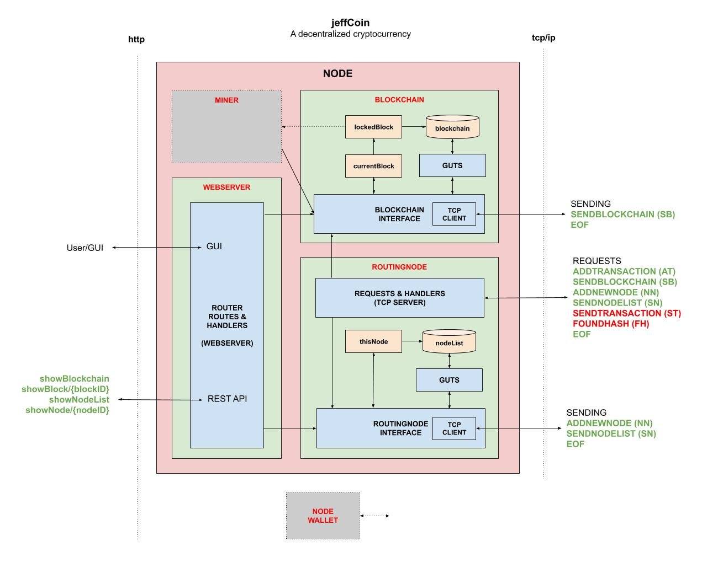

# jeffCoin

```text
*** THE REPO IS UNDER CONSTRUCTION - CHECK BACK SOON ***
```

[](https://goreportcard.com/report/github.com/JeffDeCola/jeffCoin)
[](https://godoc.org/github.com/JeffDeCola/jeffCoin)
[](https://codeclimate.com/github/JeffDeCola/jeffCoin/maintainability)
[](https://codeclimate.com/github/JeffDeCola/jeffCoin/issues)
[](http://jeffdecola.mit-license.org)

_A cryptocurrency (transaction based data) built on a multi node
decentralized P2P open network using a sha256 Proof of Work blockchain
with a REST JSON API and a TCP Server to communicate between
the nodes over IP._

Table of Contents,

* [OVERVIEW](https://github.com/JeffDeCola/jeffCoin#overview)
* [1. BLOCKCHAIN](https://github.com/JeffDeCola/jeffCoin#1-blockchain)
* [2. MINER](https://github.com/JeffDeCola/jeffCoin#2-miner)
* [3. ROUTING NODE](https://github.com/JeffDeCola/jeffCoin#3-routing-node)
* [4. WALLET](https://github.com/JeffDeCola/jeffCoin#4-wallet)
* [5. WEBSERVER](https://github.com/JeffDeCola/jeffCoin#5-webserver)
* [RUN](https://github.com/JeffDeCola/jeffCoin#run)
  * [GENESIS NODE](https://github.com/JeffDeCola/jeffCoin#genesis-node)
  * [NEW NODE](https://github.com/JeffDeCola/jeffCoin#new-node)
  * [WEBSERVER AND API](https://github.com/JeffDeCola/jeffCoin#webserver-and-api)
  * [ROUTING NODE](https://github.com/JeffDeCola/jeffCoin#routing-node)

Documentation and reference,

* The Blockchain is built from my
  [single-node-blockchain-with-REST](https://github.com/JeffDeCola/my-go-examples/tree/master/blockchain/single-node-blockchain-with-REST)
* The Webserver is built from my
  [simple-webserver-with-REST](https://github.com/JeffDeCola/my-go-examples/tree/master/api/simple-webserver-with-REST)
* The Routing Node (TCP Server) is built from my
  [simple-tcp-ip-server](https://github.com/JeffDeCola/my-go-examples/tree/master/api/simple-tcp-ip-server)
* Refer to my
  [cheat sheet on blockchains](https://github.com/JeffDeCola/my-cheat-sheets/tree/master/software/development/software-architectures/blockchain/blockchain-cheat-sheet)
* I got a lot of inspiration from
  [here](https://github.com/nosequeldeebee/blockchain-tutorial)

[GitHub Webpage](https://jeffdecola.github.io/my-go-examples/)

## OVERVIEW

This code is broken up into four main parts,

* [1. BLOCKCHAIN](https://github.com/JeffDeCola/jeffCoin/tree/master/blockchain)
  The Blockchain code
  * **Guts**
    The guts deal directly with the blockchain
  * **Blockchain Interface**
    The interface to the blockchain
* [2. MINER](https://github.com/JeffDeCola/jeffCoin/tree/master/miner)
  To mine the cryptocurrency
* [3. ROUTING NODE (TCP Server)](https://github.com/JeffDeCola/jeffCoin/tree/master/routingnode)
  To communicate between the P2P nodes (network)
  * **Requests & Handlers**
    The TCP Server
  * **Guts**
    The guts deal directly with the NodeList
  * **RoutingNode Interface**
    The interface to the routingnode
* [4. WALLET](https://github.com/JeffDeCola/jeffCoin/tree/master/wallet)
  To hold the cryptocurrency

I also added a WebServer for a GUI and an API,

* [5. WEBSERVER](https://github.com/JeffDeCola/jeffCoin/tree/master/webserver)
  The API and GUI

jeffCoin will,

* Blockchain using sha256 hash
* Allow multi node with open P2P Architecture
* Maintain a network of Nodes
* View the Entire Blockchain via a web GUI
* View the Entire Nodelist via a web GUI

This illustration may help,



## 1. BLOCKCHAIN

The blockchain section is the core of the entire design.  It contains the data
in a open format.

A block in the chain made from following struct,

```go
type BlockStruct struct {
    Index      int      `json:"index"`
    Timestamp  string   `json:"timestamp"`
    Data       []string `json:"data"`
    Hash       string   `json:"hash"`
    PrevHash   string   `json:"prevhash"`
    Difficulty int      `json:"difficulty"`
    Nonce      string   `json:"nonce"`
}
```

The states of a block are,

* **currentBlock** Receiving transactions and not part of blockchain
* **lockedBlock** Going to be added to the blockchain.
  This one is the one to be mined
* **Part of Chain** These are already in the **blockchain**

Functions in Blockchain Interface,

* **GenesisBlockchain()** Creates the Blockchain (Only run once)
* **GetBlockchain()** Gets the Blockchain
* **GetBlock()** Get a Block (via Index number) from the Blockchain
* **GetLockedBlock** Get the lockedBlock
* **GetCurrentBlock** Get the currentBlock
* **LoadBlockchain()** Receives the Blockchain and CurrentBlock
  from a Network Node
  * **SENDBLOCKCHAIN** Request
* **AddTransactionToCurrentBlock()** Add a Transaction to **CurrentBlock**

And the guts will deal directly with the Blockchain,

* **getBlockchain()** Get the Blockchain
* **getBlock()** Get a Block in the Blockchain
* **getLockedBlock** Get the lockedBlock
* **getCurrentBlock** Get the currentBlock
* **loadBlockchain()** Loads entire Blockchain
* **loadCurrentBlock()** Loads CurrentBlock
* **calculateBlockHash()** SHA256 hashing
* **isBlockValid()** Check that the newBlock is valid
* **refreshCurrentBlock()** Refresh the CurrentBlock
* **addTransactionToCurrentBlock()** Add Transaction to CurrentBlock
* **lockCurrentBlock()** Move CurrentBlock to LockedBlock (ResetCurrentBlock)
* **appendLockedBlock()** Append LockedBlock to the Blockchain
* **replaceChain()** Replace chain with a Longer one

## 2. MINER

## 3. ROUTING NODE

The routing Node has two main parts, the nodelist
and the ability to handling Node Requests (TCP Server).

A Node in the Nodelist is the following struct,

```go
type NodeStruct struct {
    Index     int       `json:"index"`
    Timestamp string    `json:"timestamp"`
    IP        string    `json:"ip"`
    Port      string    `json:"port"`
}
```

Functions in RoutingNode Interface,

* **GenesisNodeList()** Creates the nodeList (Only run once)
* **GetNodeList()** Gets the nodeList
* **GetNode()** Get a Node (via Index number) from the nodeList
* **LoadNodeList()** Receive nodeList from a network Node
  * **SENDNODELIST** Request
* **LoadThisNode()** - Load thisNode  
* **AppendThisNode()** Append thisNode to nodeList  
* **GetThisNode()** Get thisNode  
* **AppendNewNode()** Add New Node to nodeList  
* **BroadcastThisNode()** Broadcast thisNode to the Network
  * **ADDNEWNODE** Request

Handling TCP Server Requests,

* **ADDTRANSACTION (AT)** Add Transaction to CurrentBlock
* **SENDBLOCKCHAIN (SB)** Send Blockchain, LockedBlock &
  CurrentBlock to another Node
* **ADDNEWNODE (NN)** Add Node to nodeList
* **SENDNODELIST (GN)** Send NodeList to another Node
* **EOF**

And the guts will deal directly with the Nodelist,

* **getNodeList()** Get the nodelist
* **getNode()** Get a Node in the nodelist
* **loadThisNode()** Load thisNode
* **appendThisNode()** Append thisNode to nodeList
* **getThisNode()** Get thisNode
* **checkIfThisNodeinNodeList** - Check if thisNode is already in the nodeList
* **loadNodeList()** Loads entire nodelist
* **appendNewNode()** Append Node to the nodeList

## 4. WALLET

## 5. WEBSERVER

GUI,

Just the root index.

API,

```txt
/showBlockchain
/showBlock/{blockID}
/showlockedblock
/showcurrentblock
/shownodelist
/shownode/{nodeID}
/showthisnode
```

## RUN

If this is you first time running, you need to create the first node.
You only do this once.

### GENESIS NODE

```bash
go run jeffCoin.go \
       -genesis \
       -ip 192.168.20.100 \
       -wp 1234 \
       -tp 3334
```

### NEW NODES

Then all other nodes, you do something like this to hook
up to the network.  You need the ip of a network node,

```bash
go run jeffCoin.go \
       -ip 192.168.20.100 \
       -wp 1235 \
       -tp 3335 \
       -netip 192.168.20.100 \
       -netport 3334
```

```bash
go run jeffCoin.go \
       -ip 192.168.20.100 \
       -wp 1236 \
       -tp 3336 \
       -netip 192.168.20.100 \
       -netport 3335
```

```bash
go run jeffCoin.go \
       -ip 192.168.20.100 \
       -wp 1237 \
       -tp 3337 \
       -netip 192.168.20.100 \
       -netport 3336
```

This will,

* Add your Node to the node list
  * That list will be updated with the network nodes
* Receive the blockchain

### WEBSERVER AND API

The user GUI,

[192.168.20.100:1234/](http://localhost:1234/)

You could also use curl from the command line,

```go
curl 192.168.20.100:1234
```

Show a Particular Block,

[192.168.20.100:1234//showblock/0](http://192.168.20.100:1234/showblock/0)

Show the Chain,

[192.168.20.100:1234//showchain](http://192.168.20.100:1234/showchain)

### ROUTING NODE

Since no security has been setup yet, you can open a connection,

```txt
netcat -q -1 192.168.20.100 3334
```

Now add a transaction,

```txt
ADDTRANSACTION or AT
```

## UPDATE GITHUB WEBPAGE USING CONCOURSE (OPTIONAL)

For fun, I use concourse to update
[jeffCoin GitHub Webpage](https://jeffdecola.github.io/jeffCoin/)
and alert me of the changes via repo status and slack.

A pipeline file [pipeline.yml](https://github.com/JeffDeCola/jeffCoin/tree/master/ci/pipeline.yml)
shows the entire ci flow. Visually, it looks like,


The `jobs` and `tasks` are,

* `job-readme-github-pages` runs task
  [readme-github-pages.sh](https://github.com/JeffDeCola/jeffCoin/tree/master/ci/scripts/readme-github-pages.sh).

The concourse `resources types` are,

* `jeffCoin` uses a resource type
  [docker-image](https://hub.docker.com/r/concourse/git-resource/)
  to PULL a repo from github.
* `resource-slack-alert` uses a resource type
  [docker image](https://hub.docker.com/r/cfcommunity/slack-notification-resource)
  that will notify slack on your progress.
* `resource-repo-status` uses a resource type
  [docker image](https://hub.docker.com/r/dpb587/github-status-resource)
  that will update your git status for that particular commit.

For more information on using concourse for continuous integration,
refer to my cheat sheet on [concourse](https://github.com/JeffDeCola/my-cheat-sheets/tree/master/software/operations-tools/continuous-integration-continuous-deployment/concourse-cheat-sheet).
