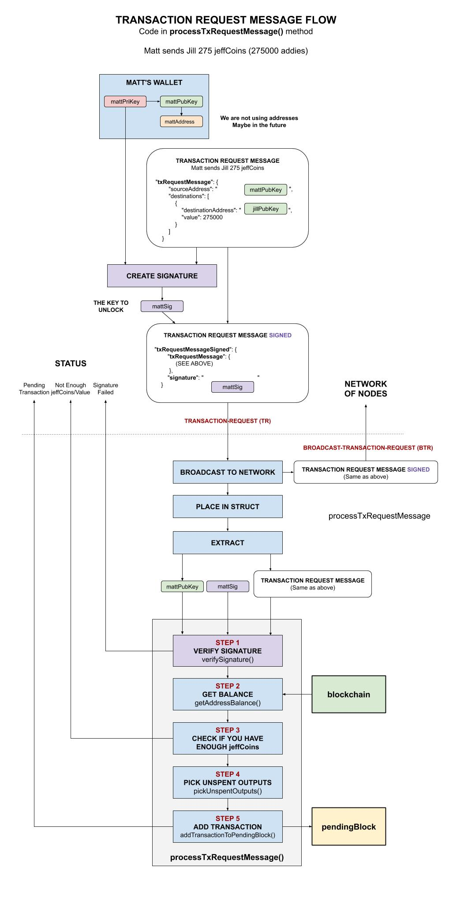
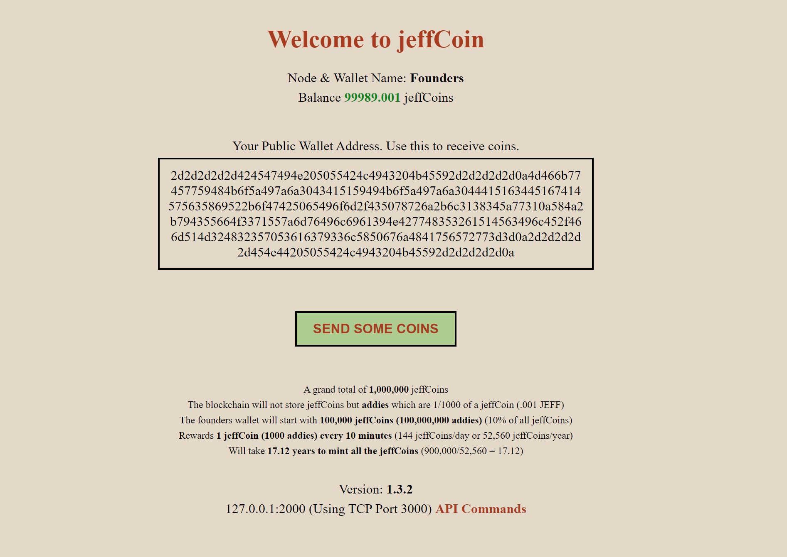

# jeffCoin ARCHITECTURE

_This readme describes the software architecture and functions/methods of jeffCoin._

Table of contents,

* [ARCHITECTURE OVERVIEW](https://github.com/JeffDeCola/jeffCoin/blob/master/architecture.md#architecture-overview)
* [1. BLOCKCHAIN](https://github.com/JeffDeCola/jeffCoin/blob/master/architecture.md#1-blockchain)
  * [1.1 BLOCKCHAIN](https://github.com/JeffDeCola/jeffCoin/blob/master/architecture.md#11-blockchain)
  * [1.2 TRANSACTIONS](https://github.com/JeffDeCola/jeffCoin/blob/master/architecture.md#12-transactions)
* [2. MINER](https://github.com/JeffDeCola/jeffCoin/blob/master/architecture.md#2-miner)
* [3. ROUTINGNODE](https://github.com/JeffDeCola/jeffCoin/blob/master/architecture.md#3-routingnode)
  * [3.1 NODELIST](https://github.com/JeffDeCola/jeffCoin/blob/master/architecture.md#31-nodelist)
  * [3.2 TCP REQUESTS & HANDLERS](https://github.com/JeffDeCola/jeffCoin/blob/master/architecture.md#32-tcp-requests--handlers)
* [4. WALLET](https://github.com/JeffDeCola/jeffCoin/blob/master/architecture.md#4-wallet)
* [5. WEBSERVER](https://github.com/JeffDeCola/jeffCoin/blob/master/architecture.md#5-webserver)
  * [5.1 GUI](https://github.com/JeffDeCola/jeffCoin/blob/master/architecture.md#51-gui)
  * [5.2 REST API](https://github.com/JeffDeCola/jeffCoin/blob/master/architecture.md#52-rest-api)

## ARCHITECTURE OVERVIEW

The following illustration shows how the code is broken up into five main areas,


## 1. BLOCKCHAIN

The blockchain section is the heart of the entire design. It will keep the
transactions secure. A transaction is a transfer of value (jeffCoins) between
jeffCoin Addresses.
Like bitcoin, the value (jeffCoins) is contained in the ledger.
The wallets just hold the public/private keys to request a transaction.

This blockchain section has two main parts, the blockchain and the transactions
(the data on the blockchain).

### 1.1 BLOCKCHAIN

This blockchain is built from my
[single-node-blockchain-with-REST](https://github.com/JeffDeCola/my-go-examples/tree/master/blockchain/single-node-blockchain-with-REST).

**[BLOCKCHAIN-DATASTRUCTURES](https://github.com/JeffDeCola/jeffCoin/blob/master/blockchain/blockchain-datastructures.go)**

A block in the blockchain is the following go struct,

```go
type blockStruct struct {
    BlockID      int64               `json:"blockID"`
    Timestamp    string              `json:"timestamp"`
    Transactions []transactionStruct `json:"transactions"`
    Hash         string              `json:"hash"`
    PrevHash     string              `json:"prevhash"`
    Difficulty   int                 `json:"difficulty"`
    Nonce        string              `json:"nonce"`
}
```

The states of a block are,

* **pendingBlock** Receiving transactions and not part of blockchain
* **lockedBlock** To be mined and added to the blockchain
* **Part of Chain** Already in the **blockchain**

This illustration may help,


**[BLOCKCHAIN-INTERFACE FUNCTIONS](https://github.com/JeffDeCola/jeffCoin/blob/master/blockchain/blockchain-interface.go)**

* BLOCKCHAIN
  * **GetBlockchain()**
    _Gets the blockchain_
  * **GenesisBlockchain()**
    _Creates the blockchain_
  * **RequestBlockchain()**
    _Requests the blockchain and the pendingBlock from a Network Node_
    * `SEND-BLOCKCHAIN Request`
* BLOCK
  * **GetBlock()**
    _Gets a block (via Index number) from the blockchain_
* LOCKED BLOCK
  * **GetLockedBlock()**
    _Gets the lockedBlock_
  * **AppendLockedBlock()**
    _Appends the lockedBlock to the blockchain_
* PENDING BLOCK
  * **GetPendingBlock()**
    _Gets the pendingBlock_
  * **ResetPendingBlock()**
    _Resets the pendingBlock_
  * **AddTransactionToPendingBlock()**
    _Adds a transaction to the pendingBlock and makes change_
  * **LockPendingBlock()**
    _Moves the pendingBlock to the lockedBlock_
* JEFFCOINS
  * **GetAddressBalance()**
    _Gets the jeffCoin Address balance_
* TRANSACTIONS
  * **ProcessTxRequestMessage()**
    _Request to transfer jeffCoins to a jeffCoin Address_

**[GUTS FUNCTIONS](https://github.com/JeffDeCola/jeffCoin/blob/master/blockchain/guts.go)**

* BLOCKCHAIN
  * **getBlockchain()**
    _Gets the blockchain_
  * **loadBlockchain()**
    _Loads the entire blockchain_
  * **replaceBlockchain()**
    _Replaces blockchain with the longer one_
* BLOCK
  * **getBlock()**
    _Gets a block in the blockchain_
  * **calculateBlockHash()**
    _Calculates SHA256 hash on a block_
  * **isBlockValid()**
    _Checks if block is valid_
* LOCKED BLOCK
  * **getLockedBlock()**
    _Gets the lockedBlock_
  * **appendLockedBlock()**
    _Appends the lockedBlock to the blockchain_
* PENDING BLOCK
  * **getPendingBlock()**
    _Gets the pendingBlock_
  * **loadPendingBlock()**
    _Loads the pendingBlock_
  * **resetPendingBlock()**
    _Resets the pendingBlock_
  * **addTransactionToPendingBlock()**
    _Adds a transaction to the pendingBlock and makes change_
  * **lockPendingBlock()**
    _Moves the pendingBlock to the lockedBlock_
* JEFFCOINS
  * **getAddressBalance()**
    _Gets the jeffCoin Address balance_

### 1.2 TRANSACTIONS

Transaction are at the heart of jeffCoin, allowing the transfer of value (jeffCoins)
from one jeffCoin Address to another.
A transaction request comes from the wallet which holds
the private key. All transaction requests are broadcast to the entire Network
before it is validated. Each Node does its own Proof of Work (PoW).

The transactions are stored in the block using the
**unspent transaction output model**.
Basically a chain of ledger transactions.

This was built using my
ecdsa signature verification from
[ecdsa-digital-signature](https://github.com/JeffDeCola/my-go-examples/tree/master/cryptography/asymmetric-cryptography/ecdsa-digital-signature)
and the transaction ledger was built from my
[bitcoin-ledger](https://github.com/JeffDeCola/my-go-examples/tree/master/blockchain/bitcoin-ledger).

**[BLOCKCHAIN-DATASTRUCTURES](https://github.com/JeffDeCola/jeffCoin/blob/master/blockchain/blockchain-datastructures.go)**

A transaction for a block is the following go struct,

```go
type transactionStruct struct {
    TxID    int64           `json:"txID"`
    Inputs  []inputsStruct  `json:"inputs"`
    Outputs []outputsStruct `json:"outputs"`
}

type inputsStruct struct {
    RefTxID   int64  `json:"refTxID"`
    InPubKey  string `json:"inPubKey"`
    Signature string `json:"signature"`
}

type outputsStruct struct {
    OutPubKey string `json:"outPubKey"`
    Value     int64  `json:"value"`
}
```

And the transaction request message is,

```go
type txRequestMessageSignedStruct struct {
    TxRequestMessage txRequestMessageStruct `json:"txRequestMessage"`
    Signature        string                 `json:"signature"`
}

type txRequestMessageStruct struct {
    SourceAddress string              `json:"sourceAddress"`
    Destinations  []destinationStruct `json:"destinations"`
}

type destinationStruct struct {
    DestinationAddress string `json:"destinationAddress"`
    Value              int64  `json:"value"`
}
```

**[TRANSACTION FUNCTIONS](https://github.com/JeffDeCola/jeffCoin/blob/master/blockchain/transactions.go)**

* TRANSACTIONS
  * **processTxRequestMessage()**
    _Request to transfer jeffCoins to a jeffCoin Address_
* SIGNATURE
  * **verifySignature()**
    _Verifies a ECDSA Digital Signature_
* UNSPENT OUTPUTS
  * **pickUnspentOutputs()**
    _Pick the Unspent Outputs to use and provide change_

This illustration shows transaction requests, verification for that request
and addition onto the pendingBlock. A transaction is never valid until
the transaction is added onto the blockchain.



## 2. MINER

The miner section has the following features,

* Miner automatically tells blockchain-interface to place
  pendingBlock into lockedBlock
* Performs the `mining (poW)` on the lockedBlocked
* Difficulty is how many zero are needed at the beginning of the hash
* When block is solved, broadcast block to entire Network to check for `consensus`

**[MINER-DATASTRUCTURES](https://github.com/JeffDeCola/jeffCoin/blob/master/miner/miner-datastructures.go)**

The proof of work structure is,

```go
type tbd struct {
    tbd
}
```

**[MINER-INTERFACE FUNCTIONS](https://github.com/JeffDeCola/jeffCoin/blob/master/miner/miner-interface.go)**

* MINING
  * **tbd()**
    _tbd_

**[GUTS FUNCTIONS](https://github.com/JeffDeCola/jeffCoin/blob/master/miner/guts.go)**

* MINING
  * **tbd()**
    _tbd_


## 3. ROUTINGNODE

The Routingnode section has two main parts, the nodeList
and the ability to handle the Node TCP Requests (TCP Server).
The nodeList keeps a listing of all Nodes in the Network.
The TCP Server handles requests from other Nodes.

The routingnode is built from my
[simple-tcp-ip-server](https://github.com/JeffDeCola/my-go-examples/tree/master/api/simple-tcp-ip-server).

### 3.1 NODELIST

**[ROUTINGNODE-DATASTRUCTURES](https://github.com/JeffDeCola/jeffCoin/blob/master/routingnode/routingnode-datastructures.go)**

A Node in the nodeList is the following go struct,

```go
type nodeStruct struct {
    Index       int    `json:"index"`
    Status      string `json:"status"`
    Timestamp   string `json:"timestamp"`
    NodeName    string `json:"nodename"`
    ToolVersion string `json:"toolversion"`
    IP          string `json:"ip"`
    HTTPPort    string `json:"httpport"`
    TCPPort     string `json:"tcpport"`
}
```

**[ROUTINGNODE-INTERFACE FUNCTIONS](https://github.com/JeffDeCola/jeffCoin/blob/master/routingnode/routingnode-interface.go)**

* NODELIST
  * **GetNodeList()**
    _Gets the nodeList_
  * **GenesisNodeList()**
    _Creates the nodeList_
  * **RequestsNodeList()**
    _Requests the nodeList from a Network Node_
    * `SEND-NODELIST Request`
* NODE
  * **GetNode()**
    _Gets a Node (via Index number) from the nodeList_
  * **AppendNewNode()**
    _Appends a new Node to the nodeList_
* THIS NODE
  * **GetThisNode()**
    _Gets thisNode_
  * **LoadThisNode()**
    _Loads thisNode_
  * **AppendThisNode()**
    _Appends thisNode to the nodeList_
  * **BroadcastThisNode()**
    _Broadcasts thisNode to the Network_
    * `BROADCAST-ADD-NEW-NODE Request`

**[GUTS FUNCTIONS](https://github.com/JeffDeCola/jeffCoin/blob/master/routingnode/guts.go)**

* NODELIST
  * **getNodeList()**
    _Gets the nodeList_
  * **loadNodeList()**
    _Loads the entire nodeList_
* NODE
  * **getNode()**
    _Gets a Node in the nodeList_
  * **appendNewNode()**
    _Appends a new Node to the nodeList_
* THIS NODE
  * **getThisNode()**
    _Gets thisNode_
  * **loadThisNode()**
    _Loads thisNode_
  * **appendThisNode()**
    _Appends thisNode to the nodeList_
  * **checkIfThisNodeinNodeList()**
    _Check if thisNode is already in the nodeList_

### 3.2 TCP REQUESTS & HANDLERS

Incoming requests to the TCP server from other Nodes or TCP connection.

An illustration of client-server handshakes,


**[HANDLERS](https://github.com/JeffDeCola/jeffCoin/blob/master/routingnode/handlers.go)**

* FROM BLOCKCHAIN I/F
  * **handleSendBlockchain()**
    _SEND-BLOCKCHAIN (**SBC**)- Sends the blockchain and pendingBlock to another Node_
* FROM ROUTINGNODE I/F
  * **handleBroadcastAddNewNode()**
    _BROADCAST-ADD-NEW-NODE (**BANN**) - Adds a Node to the nodeList_
  * **handleSendNodeList()**
    _SEND-NODELIST (SNL) - Sends the nodeList to another Node_
  * **handleBroadcastVerifiedBlock()**
    _BROADCAST-VERIFIED-BLOCK (**BVB**) - A Node verified the next block,
    get block and verify_
  * **handleBroadcastConsensus()**
    _BROADCAST-CONSENSUS (**BC**) - 51% Consensus reached, get block to add to blockchain_
  * **handleBroadcastTransactionRequest()**
    _BROADCAST-TRANSACTION-REQUEST (**BTR**) - Request from a Node
    to transfer jeffCoins to a jeffCoin Address_
* FROM WALLET I/F
  * **handleSendAddressBalance()**
    _SEND-ADDRESS-BALANCE (**SAB**) - Sends the jeffCoin balance
    for a jeffCoin Address_
  * **handleTransactionRequest()**
    _TRANSACTION-REQUEST (**TR**) - Request from Wallet to transfer jeffCoins
    to a jeffCoin Address_
* EOF
  * **EOF**
    _Close Connection_

## 4. WALLET

The wallet section holds the Public Key, the Private Key and the jeffCoin Address.
Like bitcoin, wallets do not have or hold any jeffCoins.
The jeffCoins are in the blockchain transactions (ledger).

Generating keys and creating the jeffCoin address is built from my
[create-bitcoin-address-from-ecdsa-publickey](https://github.com/JeffDeCola/my-go-examples/tree/master/blockchain/create-bitcoin-address-from-ecdsa-publickey).

Your wallet will be saved in the following file based on your nodename,
`/wallet/{nodename}-wallet.json`.

**[WALLET-DATASTRUCTURES](https://github.com/JeffDeCola/jeffCoin/blob/master/wallet/wallet-datastructures.go)**

A wallet has the following go struct,

```go
type walletStruct struct {
    PrivateKeyHex   string `json:"privateKeyHex"`
    PublicKeyHex    string `json:"publicKeyHex"`
    JeffCoinAddress string `json:"jeffCoinAddress"`
}
```

**[WALLET-INTERFACE FUNCTIONS](https://github.com/JeffDeCola/jeffCoin/blob/master/wallet/wallet-interface.go)**

* WALLET
  * **GetWallet()**
    _Gets the wallet_
  * **GenesisWallet()**
    _Creates the wallet and writes to file (Keys and jeffCoin Address)_
  * **ReadWalletFile()**
    _Reads the wallet from a file and puts in struct_
* KEYS
  * **EncodeKeys()**
    _Encodes privateKeyRaw & publicKeyRaw to privateKeyHex & publicKeyHex_
  * **DecodeKeys()**
    _Decodes privateKeyHex & publicKeyHex to privateKeyRaw & publicKeyRaw_
* JEFFCOINS
  * **RequestAddressBalance()**
    _Requests the jeffCoin balance for a jeffCoin Address_
    * `SEND-ADDRESS-BALANCE Request`
  * **TransactionRequest()**
    _Request to transfer jeffCoins to a jeffCoin Address_
    * `TRANSACTION-REQUEST Request`
* SIGNATURE
  * **CreateSignature()**
    _Creates a ECDSA Digital Signature_
* ENCRYPT/DECRYPT TEXT
  * **EncryptAES()**
    _AES-256 GCM (Galois/Counter Mode) mode encryption_
  * **DecryptAES()**
    _AES-256 GCM (Galois/Counter Mode) mode decryption_

**[GUTS FUNCTIONS](https://github.com/JeffDeCola/jeffCoin/blob/master/wallet/guts.go)**

* WALLET
  * **getWallet()**
    _Gets the wallet_
  * **makeWallet()**
    _Creates the wallet and writes to file (Keys and jeffCoin Address)_
  * **readWalletFile()**
    _Reads the wallet from a file and puts in struct_
* KEYS
  * **generateECDSASKeys()**
    _Generate privateKeyHex and publicKeyHex_
  * **encodeKeys()**
    _Encodes privateKeyRaw & publicKeyRaw to privateKeyHex & publicKeyHex_
  * **decodeKeys()**
    _Decodes privateKeyHex & publicKeyHex to privateKeyRaw & publicKeyRaw_
* JEFFCOIN ADDRESS
  * **generateJeffCoinAddress()**
    _Creates a jeffCoin Address_
  * **hashPublicKey()**
    _Hashes publicKeyHex_
  * **checksumKeyHash()**
    _Checksums verPublicKeyHash_
  * **encodeKeyHash()**
    _Encodes verPublicKeyHash & checkSum_
* SIGNATURE
  * **createSignature()**
    _Creates a ECDSA Digital Signature_
* ENCRYPT/DECRYPT TEXT
  * **encryptAES()**
    _AES-256 GCM (Galois/Counter Mode) mode encryption_
  * **decryptAES()**
    _AES-256 GCM (Galois/Counter Mode) mode decryption_

## 5. WEBSERVER

The webserver section has two main parts, the GUI and the REST API.

This webserver is built from my
[simple-webserver-with-REST](https://github.com/JeffDeCola/my-go-examples/tree/master/api/simple-webserver-with-REST).

There is also a session based authentication when a user logs in.

**[WEBSERVER-DATASTRUCTURES](https://github.com/JeffDeCola/jeffCoin/blob/master/webserver/webserver-datastructures.go)**

A password has the following go struct,

```go
// passwordStruct is your password
type passwordStruct struct {
    Password   string `json:"password"`
}
```

**[WEBSERVER-INTERFACE FUNCTIONS](https://github.com/JeffDeCola/jeffCoin/blob/master/webserver/webserver-interface.go)**

* PASSWORD
  * **GetPassword()**
    _Gets the password_
  * **WritePasswordFile()**
    _Writes the password to file (AES-256 encryption) and puts in struct_
  * **ReadPasswordFile()**
    _Reads the password from a file (AES-256 decrypt and puts in struct_

**[GUTS FUNCTIONS](https://github.com/JeffDeCola/jeffCoin/blob/master/webserver/guts.go)**

* PASSWORD
  * **getPassword()**
    _Gets the password_
  * **writePasswordFile()**
    _Writes the password to file (AES-256 encryption) and puts in struct_
  * **readPasswordFile()**
    _Reads the password from a file (AES-256 decrypt) and puts in struct_

### 5.1 GUI

Currently, there is the main page that also lists the available APIs.

* [127.0.0.1:2000](http://127.0.0.1:2000)

The screen should look similar to the following,



### 5.2 REST API

**[API COMMANDS](https://github.com/JeffDeCola/jeffCoin/blob/master/webserver/handlers.go)**

* BLOCKCHAIN
  * **/showBlockchain**
  * **/showBlock/{blockID}**
* LOCKED BLOCK  
  * **/showlockedblock**
  * **/appendlockedblock** - _Must be Founder_
* PENDING BLOCK
  * **/showpendingblock**
  * **/resetpendingblock** - _Must be Founder_
  * **/lockpendingblock** - _Must be Founder_
* NODELIST
  * **/shownodelist**
  * **/shownode/{nodeID}**
  * **/showthisnode**
* WALLET (THIS NODE)
  * **/showwallet**
  * **/showjeffcoinaddress**
  * **/showbalance**
  * **/transactionrequest/{destinationaddress1,destinationaddress2,...}/{value1,value2,...}**
* WALLET (OTHER)
  * **/showaddressbalance/{jeffcoinaddress}**
